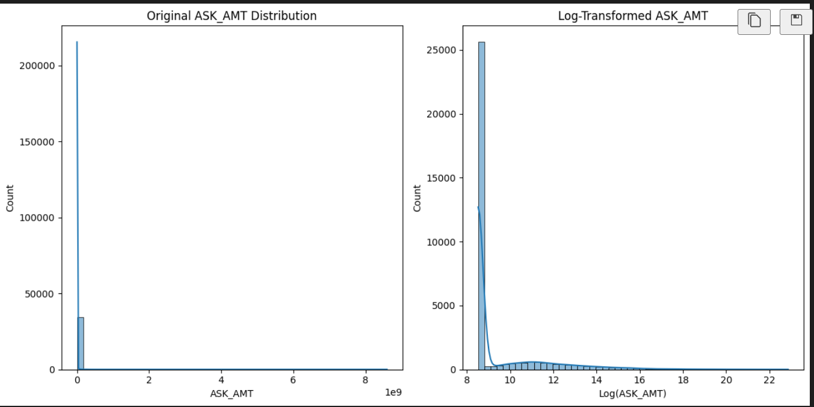
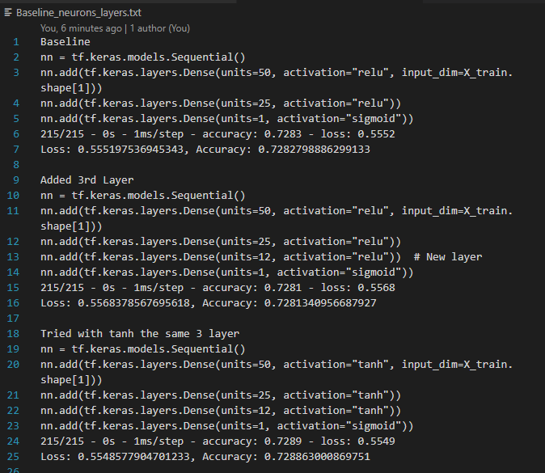

# **Alphabet Soup Charity Optimization Report**

## **Overview**: The goal was to build and optimize a deep learning model to predict successful funding applications.

### **Results**
  #### **Data Processing**
  - Target Variable(s):
    - The Target was the column **IS_SUCCESSFUL**
  - Feature Variables:
    - The Feature variables included the following (**APPLICATION_TYPE,AFFILIATION	CLASSIFICATION,	USE_CASE,	ORGANIZATION,	STATUS,	INCOME_AMT,	SPECIAL_CONSIDERATIONS,	ASK_AMT**)
    - The following variables were removed from the input data because they are neither targets nor features (**EIN, NAME, and the original ASK_AMT**), **ASK_AMT** due to extreme outliers there for was transformed and renamed to **ASK_AMT_LOG** and used in the Features
    - "Reintroducing the NAME feature during optimization significantly improved the model. Although the initial instructions recommended dropping it, including it proved beneficial."
  #### **Compiling, Training, and Evaluating the Model**
  - How many neurons, layers, and activation functions did you select for your neural network model, and why? This model consists of three hidden layers with 100, 30, and 10 neurons, respectively. After experimenting with different architectures, this configuration yielded the best performance within the given time constraints.
  - Were you able to achieve the target model performance? YES
  - See added notes. 

### **Visualizations** 

  - "The distribution of ASK_AMT is highly skewed, with most values concentrated near zero and a few extreme outliers."
  - "A significant discrepancy in ASK_AMT exists, with most values being very low, while some are extremely high. The log transformation helps reveal this pattern more clearly."

  - Examples of optimization using neurons and layers. For more: See [Added Notes](#added-notes)

### **Summary**: Overall, by increasing the accuracy above 75% we are able to correctly classify each of the points in the test data 75% of the time. Additionally, the model predicts successful applications with approximately 80% confidence. 

### **Added Notes**
[Baseline Neurons and Layers](Baseline_neurons_layers.txt)